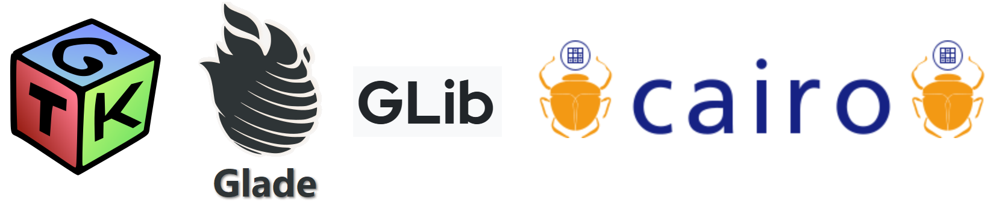
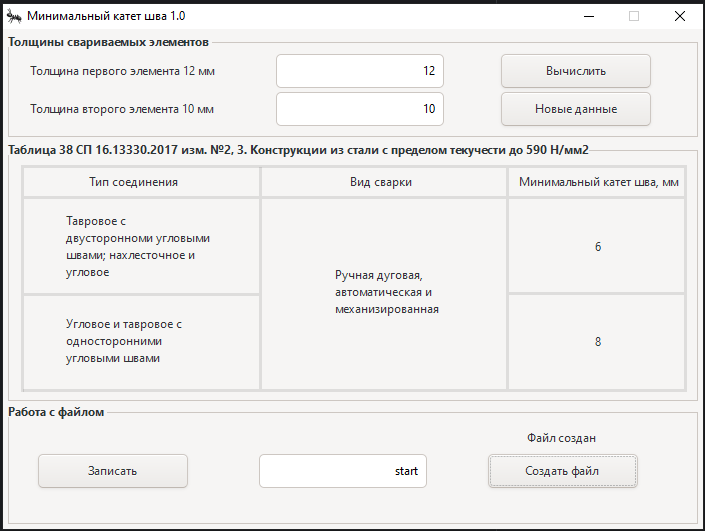
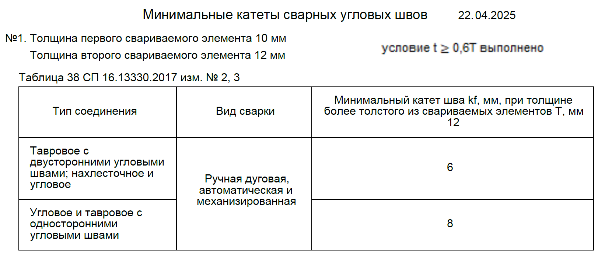
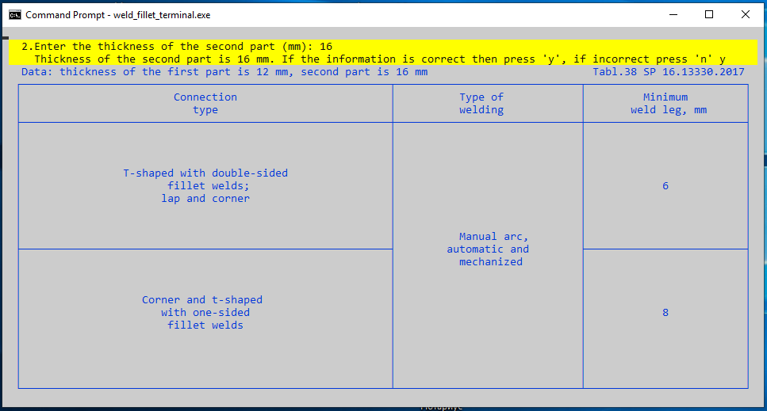

# Многомодульная программа 
### Приложение "Определение минимального катета сварного шва стальных конструкций"

Цель разработки: реализация требований табл. 38 СП 16.13330.2017 изм. 2, 3.

При запуске приложения, для получения результата, необходимо ввести следующие параметры:

* толщина первого привариваемого элемента;
* толщина второго привариваемого элемента.

<strong> &#128194; weld_fillet_gui </strong> - настольное приложение

 Приложение разработано  с использованием **Glade ,GTK+ 3, GLib, Cairo**. 

 

 Предусмотрено создание **pdf** файла с результатами подбора катета.

(<a href="#readme-top">вверх</a>)

 <strong> &#128194; weld_fillet_terminal </strong> - консольное приложение

Приложение имеет текстовый интерфейс пользователя. Такая возможность, при разработке в Windows, предоставляется библиотекой управления терминалом **curses.h**.

(<a href="#readme-top">вверх</a>)

